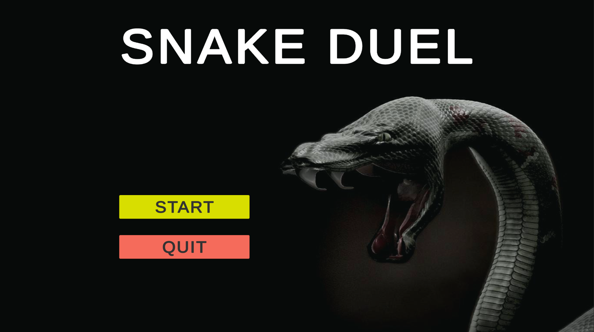
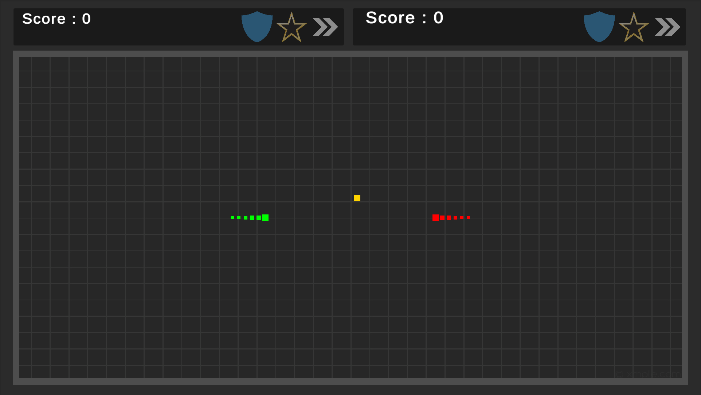
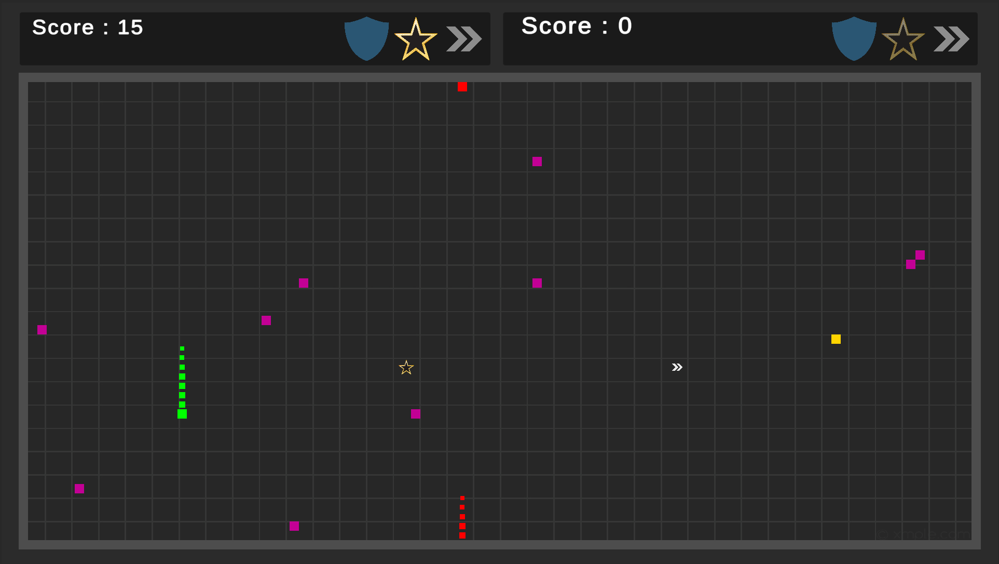
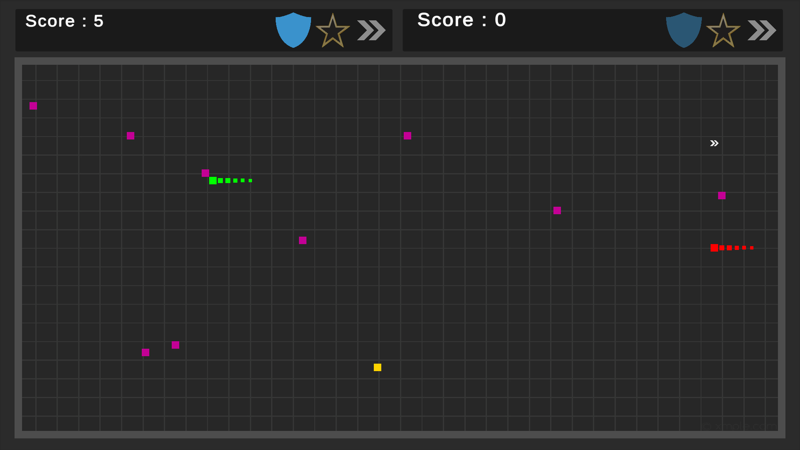
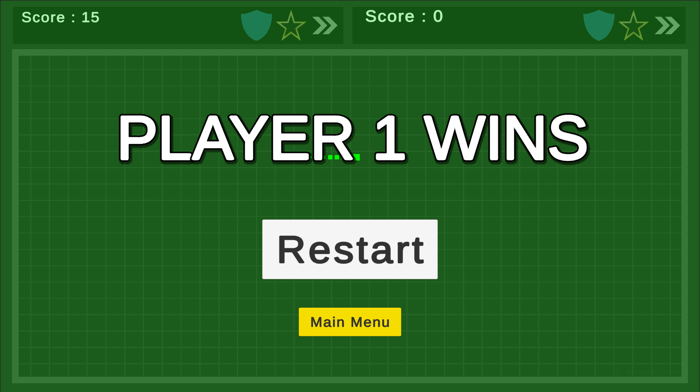
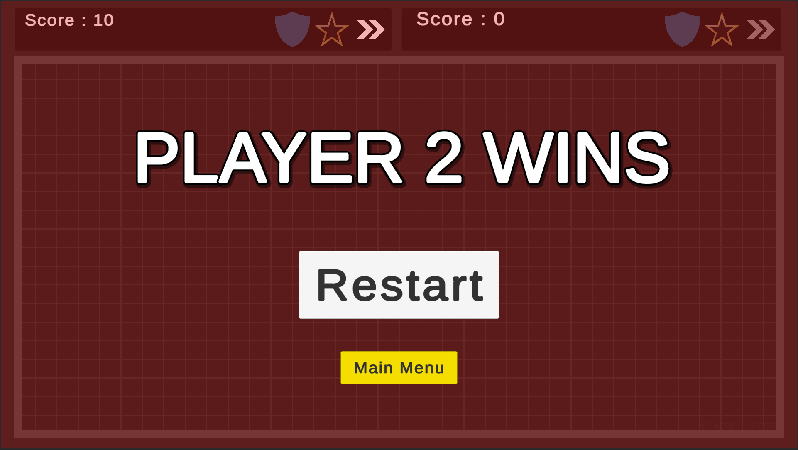

# 2D CoOpSnakeGame
2 player 2d co-op snake game with powerUps made in unity

# Features
- Couch Mutliplayer game.
- Easily remapable controls.
- Screen Warping for both snakes.
- Eating food increases size and score.
- Eating poison Decreases size and score.
- 3 Power ups available.
  - score boost: inscreses the score gained for an interval.
  - Speed Boost : Inscreases the speed for an interval.
  - Sheild : Defends agains head hitting anything for an interval.

# ScreenShots

